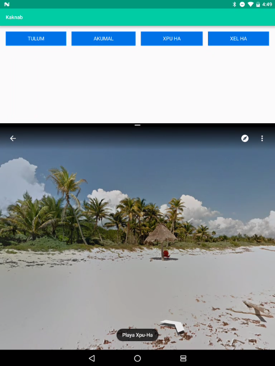

Kaknab
======
*Kaknab* is the Mayan word for 'sea' or 'ocean'. This app displays
ocean side views in Mayan locations along the Yucatan Peninsula in 
Mexico.

The goal of this application was to spend some time playing around
with the new N Preview split screen mode. Tap on a button and Google
Maps street view will launch. Long press on the recent apps button to get
into split screen mode, and then you can toggle between the 4 preset
ocean views, while having both Google Maps and Kaknab open at the same
time.

